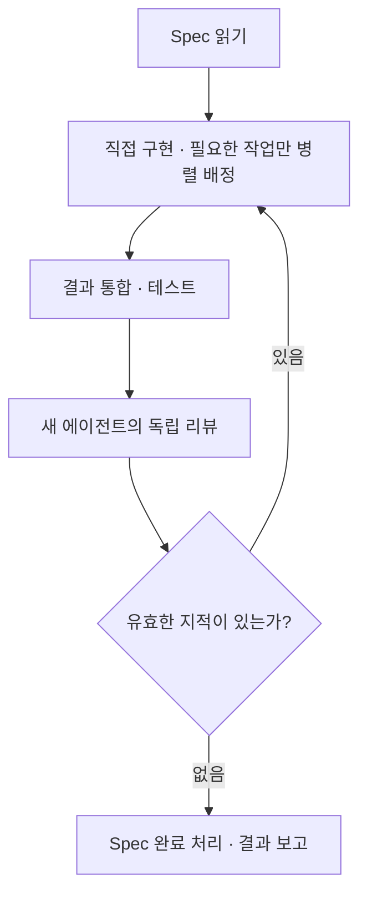

# 구현 실행 구조

`start-implementation`은 모델을 고르고 새 세션을 만든다. `implement`는 그 세션에서 Spec을 구현하고 독립 리뷰를 받아 수정한다.

## 세션 생성

[모델 선택 기준](../skills/start-implementation/assets/model-routing.md)과 사용자가 지정한 설정에 따라 모델·추론 수준을 정한다. 현재 프로젝트 폴더에 새 세션을 만들고 `$proofline:implement SPEC-0001` 한 줄을 전달한다. 원래 세션은 생성 결과를 보고한 뒤 끝난다.

## 구현과 리뷰

구현자는 기존 사용자 변경을 보존하고 이번 작업의 변경을 구분한다. 병렬 작업은 수정 범위가 겹치지 않게 배정하고 결과를 통합한다. 작업자 모델에도 같은 선택 기준을 적용한다.

리뷰어는 주 구현자와 같은 모델·추론 수준의 새 문맥에서 Spec, 실제 변경과 테스트 결과를 읽는다. 구현 대화나 이전 리뷰 이력은 받지 않는다. 유효한 지적은 수정하고 관련 테스트와 독립 리뷰를 다시 수행한다. Spec과 무관한 개선 제안은 구현 범위를 늘리지 않는다.

완료 조건을 충족하고 유효한 지적이 없으면 기존 문서 작성 도구로 Spec 상태를 `completed`로 바꾼다. 별도의 요구사항 등록, 실행 상태 파일, 검증 장부, 리뷰 패킷이나 완료 승인 도구는 사용하지 않는다.

## 검증 범위

자동 테스트는 세션 생성 인수·Spec 문서 갱신·역할별 권한과 스킬 지침을 확인한다. 실제 모델이 구현·리뷰 루프를 얼마나 잘 수행하는지와 비용 절감률은 별도 실측이 필요하다.

[구현 스킬](../skills/implement/SKILL.md) · [세션 생성 스킬](../skills/start-implementation/SKILL.md)
