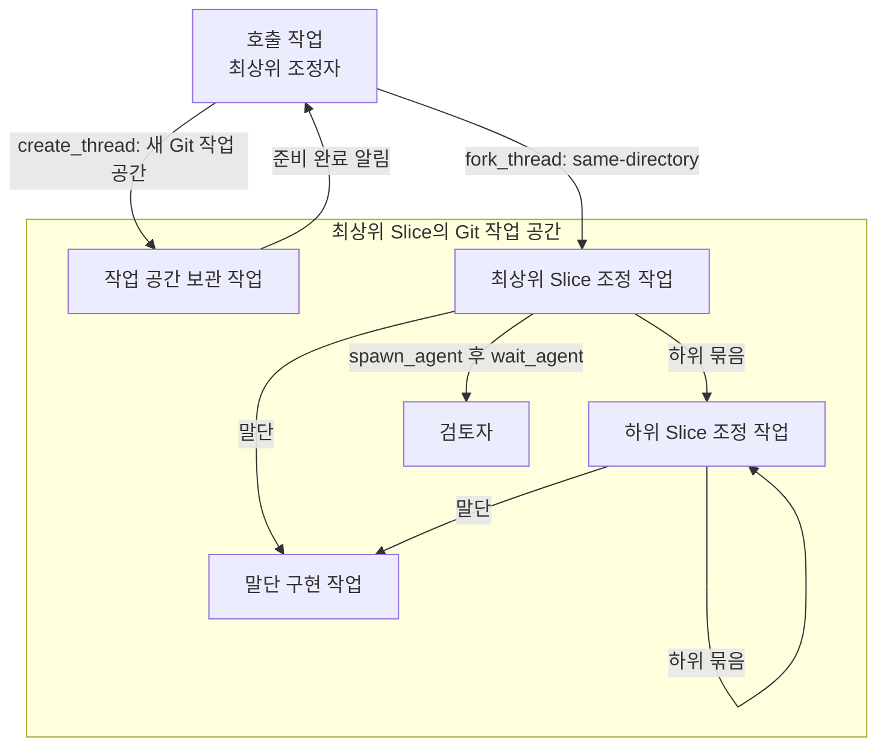
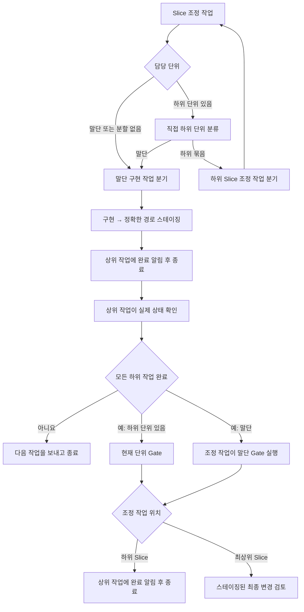
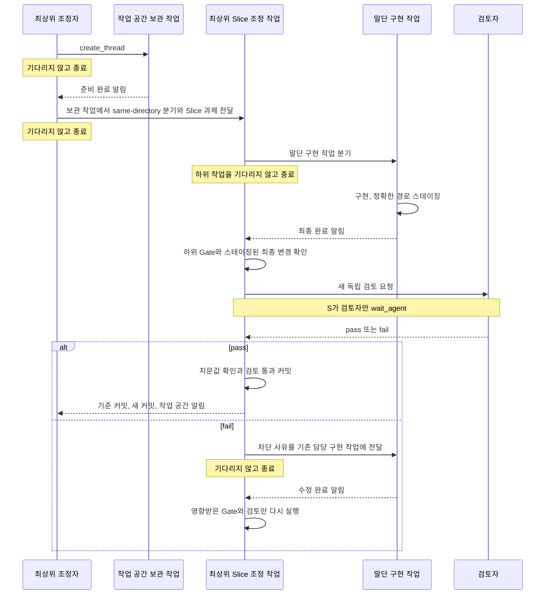

# Start Implementation 실행 골격

`start-implementation`의 실행 구조를 설명한다. 실제 실행 규칙은 스킬 본문과 연결된 역할별 작업 전달문이 기준이다.

## 작업과 Git 작업 공간

- Codex에는 새 Git 작업 공간을 만들면서 그 안의 조정 작업까지 바로 돌려주는 기능이 없다. `create_thread`로 보관 작업을 만든 뒤, 준비 완료 알림을 받으면 그 작업에서 `same-directory`로 분기해 최상위 Slice 조정 작업을 만든다.
- 최상위 조정자는 실행 가능한 최상위 Slice마다 이 절차를 반복한다. 분할 없는 경우에는 보관 작업에서 분기한 구현 작업이 구현·Gate·검토·커밋을 맡으며 별도 Slice 조정 작업을 만들지 않는다.
- 보관 작업은 Git 작업 공간만 제공한다. 실행 단위, 구현, Gate, 검토, 커밋을 맡지 않는다.
- 조정 작업은 직접 하위 묶음을 하위 조정 작업으로, 직접 말단을 구현 작업으로 분기한다.
- 작업 간 반환은 `send_message_to_thread`를 사용한 완료 알림이다. 상위 작업은 하위 작업을 기다리거나 진행 상황을 조회하지 않는다.
- 하위 작업은 완료 알림으로 복귀하므로 조정 작업이 기다리지 않는다. `wait_agent`는 검토 경계 소유자가 직접 만든 검토자에만 사용한다.

## 최상위 Slice의 실행 경계

하나의 최상위 Slice 아래 모든 작업은 같은 Git 작업 공간을 사용한다. 각 말단 구현 작업은 자기 변경만 구현하고 정확한 경로를 스테이징한다. 조정 작업이 완료 알림을 받으면 해당 경계의 미충족 Gate만 실행한다. 모든 말단 변경은 하나의 스테이징된 최종 변경으로 합쳐진다.

최상위 Slice는 다음 조건을 만족하도록 나눈다.

- 하위 결과를 같은 작업 공간에서 안전하게 합칠 수 있음
- 합쳐진 변경과 요구사항을 한 번에 검토할 수 있음
- 검토를 통과한 변경을 하나의 커밋으로 전달할 수 있음

하위 Slice는 이 경계를 다시 만들지 않는다. 큰 작업의 조정만 재귀적으로 나눈다.

## 재귀 실행

조정 작업은 완료 알림을 받을 때만 다시 실행된다. 완료 알림은 단위 ID와 완료 상태 또는 중단 이유만 담고, 변경 경로·Gate·다음 작업은 조율 상태 도우미가 한 번에 판정한다.

수정이 필요하면 실패를 소유한 가장 깊은 기존 작업에 차단 사유만 전달한다. 분할 없는 구현은 같은 작업이 직접 수정하고, 하위 단위는 기존 담당 작업이 수정한다. 소유 경계가 없으면 `explicit re-slice required`로 중단한다.

## 검토와 커밋

검토 전에는 Spec에 고정된 완료 검증만 끝낸다. 구현 작업은 필요한 생성물을 만들고 스테이징한 뒤 완료 검증을 직접 실행하지 않는다. `coordinator-state close`가 해당 스테이징 상태의 완료 검증을 한 번 실행한다. 각 검사는 모든 전제조건이 처음 모이는 가장 낮은 경계에 한 번만 배치한다. 말단 Gate는 합산 전 확인, 묶음 Gate는 합쳐진 동작, Spec Gate는 여러 최상위 Slice 또는 원본 환경의 조합만 담당한다. 기계적 검사가 없는 경계는 비용 0으로 닫고 대체 검사를 만들지 않는다. 같은 지문값의 성공 결과는 검토·커밋·전달·최종 적용에서 재사용한다.

검토자는 경로별 변경량과 지문값이 있는 작은 snapshot 목록부터 확인하고, 목록의 스테이징 경로에 대해 `git diff --cached`를 한 번 실행한다. 분할이 없거나 최상위 Slice가 하나뿐이면 Spec을 검토 경계로 사용하고, 이 검토가 최종 Spec 검토도 겸한다. 코드는 수정하지 않는다. 범위 밖 문제는 별도로 보고하지만 `pass | fail`에는 영향을 주지 않는다.

최상위 Slice가 둘 이상이면 최상위 조정자가 검토된 커밋만 의존 순서대로 하나의 Git 작업 공간에 통합한다. 조합을 판정하는 Spec Gate만 실행한 뒤 기준 커밋부터 현재 커밋까지의 변경 목록과 지문값을 만들고, 새 검토자를 직접 생성해 기다린다. 별도 통합 조정 작업은 만들지 않는다.

## 완료 기준

- 말단 완료 알림: 구현과 스테이징 완료 또는 중단 이유 반환. 상위 조정 작업이 Gate를 실행하기 전에는 완료 아님
- 하위 Slice 완료 알림: 하위 트리의 Gate 결과 반환. 최상위 Slice 검토 전에는 완료 아님
- 최상위 Slice 완료: 모든 하위 Gate 증거 기록, 스테이징된 최종 변경의 새 독립 검토 `pass`, 지문값 유지, 상태 `completed`, 검토 통과 커밋
- Spec 완료: 최상위 Slice가 하나면 해당 Spec 경계 검토와 확인된 하위 Gate를 재사용하고 원본 적용 검증으로 이동, 여러 개면 통합 Gate와 통합된 변경의 새 검토 `pass`
- 원본 완료: 기록한 `HEAD`와 기존 변경 유지, 검토된 커밋과 지문으로 정확한 제품 변경 적용, 아직 충족되지 않은 원본 환경 전용 검사만 통과. 같은 지문에서 확인한 Gate는 다시 실행하지 않음
- `ABANDON`, 해결되지 않은 `need_confirm`, 반복 실패, 통합 충돌, 적용 대상 실패: 미완료이며 Git 작업 공간 보존
