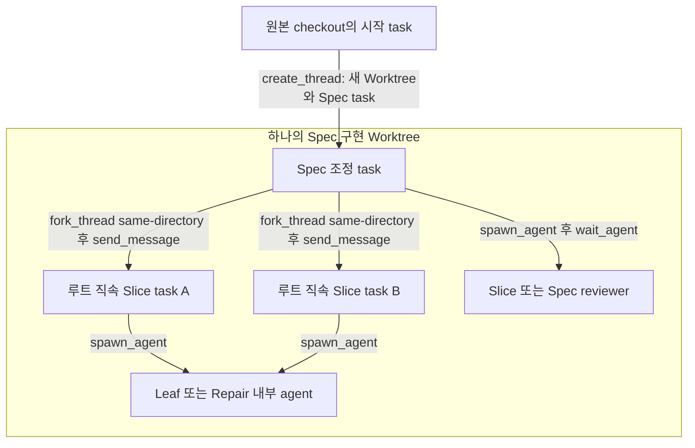
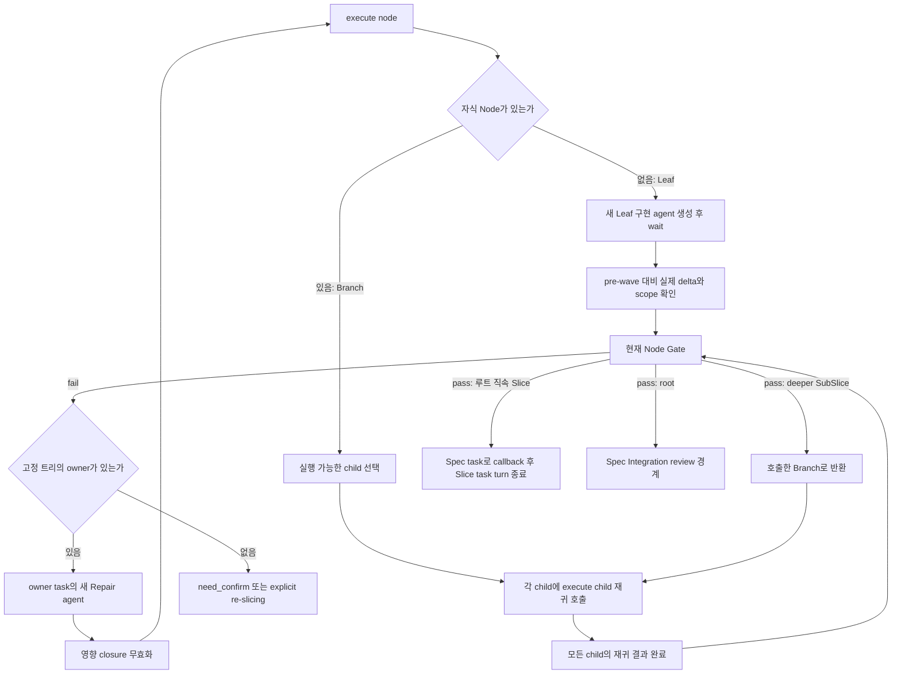
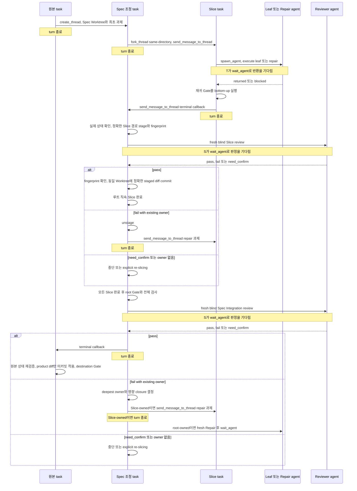

# Start Implementation 실행 골격

이 문서는 `start-implementation` 리팩터링용 구조 설명이다. 실행 규칙의 원문은 각 Skill에 둔다.

## Task와 Worktree

- `create_thread`: 원본 task가 Spec 조정 task와 Spec Worktree를 한 번 만들 때만 사용한다.
- `fork_thread(environment: { type: "same-directory" })`: Spec 조정 task가 같은 Worktree를 쓰는 루트 직속 Slice task를 만들 때 사용한다.
- `send_message_to_thread`: fork 직후 과제를 보내고, 실행 task가 과제를 보낸 task로 terminal callback을 보낼 때 사용한다. 메시지의 sender metadata로 반환 대상을 알 수 있으므로 brief에 `threadId`나 `report_destination`을 넣지 않는다.
- SubSlice는 새 task가 아니다. 해당 Slice task 안에서 재귀 실행한다. Leaf와 Repair만 내부 agent다.
- Slice task와 내부 agent는 stage·commit·review하지 않는다. Spec 조정 task가 하나의 Git index와 모든 review·commit을 직렬 소유한다.

## 재귀 실행

`execute(child)`는 같은 그림 전체를 다시 적용한다. 따라서 Branch 깊이에는 제한이 없다. 하위 Gate는 Leaf부터 Branch까지 bottom-up으로 닫힌다. 루트 직속 Slice의 Gate 통과와 callback은 실행 반환일 뿐 완료가 아니다.

Repair가 코드를 바꾸면 다음만 다시 연다.

1. 고친 Node와 전체 하위 트리
2. 그 결과에 `blocked_by`로 의존하는 형제와 하위 트리
3. root까지의 조상
4. 영향받은 Slice review와 최종 review

`run_after`는 순서만 정하므로 영향 closure를 넓히지 않는다.

## Review 위치와 callback

Reviewer는 재귀 실행자나 Slice task가 아니다. Slice reviewer는 루트 직속 Slice가 callback한 뒤 Spec 조정 task가 만들고, 최종 reviewer는 모든 Slice와 root Gate가 끝난 뒤 만든다. Reviewer는 판정만 하며 Repair를 직접 만들거나 코드를 고치지 않는다.

## 완료 경계

- Slice callback: subtree 실행 반환. 완료 아님.
- Slice 완료: subtree Gate 통과, fresh Slice review `pass`, fingerprint 유지, 동일 Spec Worktree의 정확한 로컬 commit.
- Spec 완료: 모든 Slice 완료, root Gate·전체 검사 통과, fresh Spec Integration review `pass`.
- 원본 완료: 기록된 HEAD·dirty state·비중첩 유지, product diff의 미커밋 적용, destination Gate 통과.
- `ABANDON`, unresolved `need_confirm`, 반복 실패, destination 실패: 미완료. 원본 변경과 Spec Worktree를 보존한다.
