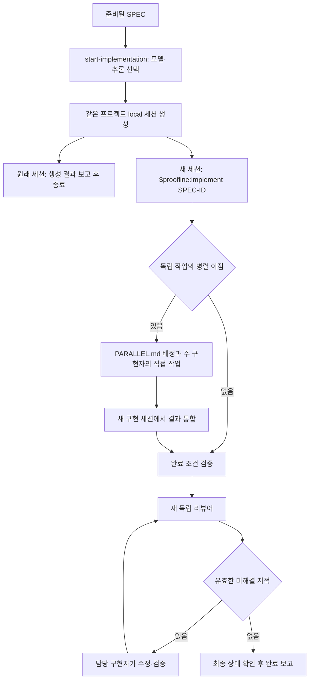

# Start Implementation 실행 구조

준비된 SPEC을 받은 `start-implementation`은 모델·추론 수준을 선택하고 현재 프로젝트 폴더에 새 구현 세션을 만든다. 원래 세션은 생성 결과와 작업 링크를 보고하고 종료한다. 새 세션의 [implement](../skills/implement/SKILL.md)가 구현·통합·검증·독립 리뷰·완료 판단을 소유한다.

## 생성과 구현의 경계

`figure-it-out`은 준비된 SPEC을 생성 담당 스킬에 넘기는 데서 끝난다. 메시지는 `$proofline:implement SPEC-0001` 한 줄이다. 모델·추론·저장 프로젝트·`local` 위치는 작업 생성 인수로 지정한다. 대화 이력이나 별도 인계 문서를 전달하지 않는다.

읽기 전용 생성 인수 도구는 SPEC의 고유성·준비 상태와 현재 폴더에 대응하는 저장 프로젝트를 확인한다. 모델 지원과 지정 권한은 실행 환경에서 확인한다. 사용자 명시가 필요한 도구에서는 해당 모델 선택을 받은 뒤 생성한다. 필요한 기능이 없거나 생성에 실패하면 제한을 보고하며 다른 모델·프로젝트·작업 위치로 대체하지 않는다. 원래 세션의 결과 대기·콜백·진행 감시는 없다.

## SPEC 계약과 실행 상태

SPEC은 구현·검토에 필요한 요구사항, 결정, 경계, 완료 조건과 원본 자료를 담는다. 새 세션은 SPEC과 필요한 저장소 근거를 읽고 시작 상태를 기록한다. 실행 근거 도구는 SPEC 원문·ID·revision·해시를 보존한다. 원래 대화의 요청 전문이나 별도의 초기 승인 목록은 입력하지 않는다.

실행 상태 형식은 버전 2다. 실행 중 승인된 변경은 SPEC에 반영한 뒤 기존 `authority` 기능으로 기록하고 관련 검증·리뷰를 갱신한다. 기존 실행 기록의 재개·자동 변환과 주 구현 세션의 자동 재생성·이관은 다루지 않는다.

## 구현과 병렬 배정

주 구현자는 새 세션의 실제 모델·추론 수준으로 직접 구현한다. 독립 실행의 이점이 있을 때만 `spec-slice`로 SPEC 옆의 `PARALLEL.md`에 범위와 인터페이스를 정의한다. 병렬 쓰기는 겹치지 않게 배정하며, 종속 작업은 순차 수행한다.

병렬 구현자는 필요한 SPEC 문맥·담당 범위·인터페이스만 받는다. 주 구현자는 배정 직후 자기 작업을 계속하고 결과가 필요한 때 기다려 통합한다. 실행 중 조정은 `send_message`, 기존 구현자의 후속 작업은 `followup_task`로 전달한다. 병렬 구현자는 재귀 위임하지 않는다.

새 구현 세션과 병렬 구현자에 공통 [모델 라우팅](../skills/start-implementation/assets/model-routing.md)을 적용한다. 기본값은 Astra `medium`이며, Luna/Sol로 충분하다는 근거가 있을 때 해당 모델을 선택한다. 준비 단계와 리뷰어는 각자의 설정 계약을 따른다.

실패를 만난 구현자가 먼저 조사·수리·검증한다. 병렬 구현자 교체가 필요하면 기존 쓰기가 끝난 뒤 현재 변경과 실패 근거를 넘긴다. 환경·권한·요구사항 문제는 원인에 맞게 처리하며, 새 근거나 진전 없이 실패가 반복되면 차단 사유를 보고한다.

## 검증·독립 리뷰·완료

기존 스테이징·미추적 파일을 포함한 작업 상태를 보존하고 이번 실행의 실제 변경분을 구분한다. 리뷰용 자동 스테이징·커밋은 하지 않는다. 필수 완료 조건과 사용자 지정 검증을 지키며, 관련 상태가 같으면 성공 근거를 재사용하고 변경되면 영향받는 검사만 갱신한다.

리뷰어는 매번 새 문맥에서 배정 당시 주 구현자와 같은 모델·추론 수준으로 실행한다. 입력은 보존된 SPEC 계약과 관련 원본 자료·실제 변경분·현재 검증 근거다. 이전 리뷰 결과·수리 이력·구현자의 자기평가는 전달하지 않는다.

요구사항 미충족, 이번 변경으로 생긴 회귀, 직접 영향을 받는 계약 위반만 완료를 차단한다. 범위 밖 지적은 SPEC과 변경 근거로 제외 사유를 기록한다. 모든 필수 검증과 최신 상태의 수용 가능한 독립 리뷰가 있어야 완료하며, 결과는 새 구현 세션에서 사용자에게 보고한다.

## 검증 범위

생성 인수 CLI와 임시 Git 프로젝트에서 정확한 한 줄 메시지·local 위치·선택 설정 보존·SPEC 오류를 검증한다. SPEC 단독 실행, 상태 버전 구분, 기존 변경 보존, 검증 무효화, 독립 리뷰와 완료 차단을 실제 상태 테스트로 확인한다. 프롬프트 계약 검사와 독립 시나리오 검토로 생성·구현의 책임 경계와 모델 선택을 확인하고 `npm test`를 실행한다.

이 검사에서는 실제 사용자 작업 생성·플러그인 재설치·배포를 하지 않는다. 자동 선정 모델 적용은 생성 도구의 허용 범위에 한정되며, 실제 생성과 모델별 품질·비용 우위는 별도 실측 없이 검증됐다고 주장하지 않는다.
